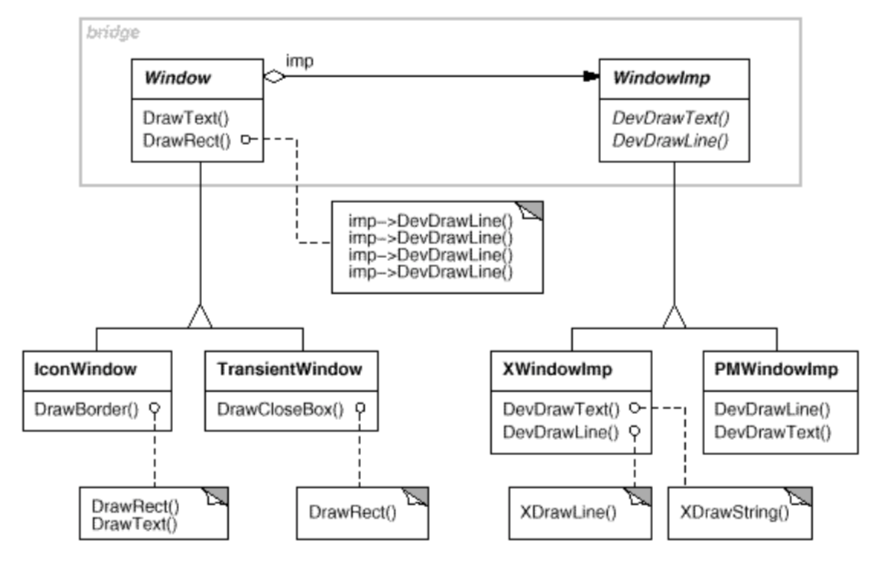

# Bridge

## 의도
- 구현에서 추상을 분리하여, 이들이 독립적으로 다양성을 가질 수 있도록 합니다.
  - Decouple an abstraction from its implementation so that the two can vary independently.
  - 구현에서 추상을 분리하여, 이들이 독립적으로 확장될 수 있게 합니다.

## 다른 이름
Handle/Body

## 동기
- 추상적 개념에 해당하는 클래스 계통과 구현에 해당하는 클래스 계통을 분리함
- 문제점
  - Window 추상을 확장하기가 불편
    
  - 사용자 코드가 플랫폼에 종속

## 활용성
- 추상적 개념과 이에 대한 구현 사이의 지속적인 종속 관계를 피하고 싶을 때
- 추상적 개념과 구현 모두가 독립적으로 서브클래싱을 통해 확장되어야 할 때
- 추상적 개념에 대한 구현 내용을 변경하는 것이 다른 관련 프로그램에 아무런 영향을 주지 않아야 할 때
- 사용자에게 구현을 완벽하게 은닉하길 원할 때
- 클래스 계통에서 클래스 수가 급증하는 것을 방지하고자 할 때
- 여러 객체들에 걸쳐 구현을 공유하고자 할 때 (+ 이런 사실을 사용자 쪽에 공개하고 싶지 않을 때)

## 구조

## 참여자
- Abstraction
- RefinedAbstraction
- Implementor
- ConcreteImplementor

## 협력 방법
- Abstraction 클래스가 사용자 요청을 Implementor 객체에 전달합니다.

## 결과
1. 인터페이스와 구현 분리 (Decoupling interface and implementation)
2. 확장성 향상 (Improved extensibility)
3. 구현 세부 사항을 사용자에게서 숨기기 (Hiding implementation details from clients)

## 구현
1. Implementor 하나만 둡니다.
2. 정확한 Implementor 객체를 생성합니다.
3. Implementor를 공유합니다.
4. 다중 상속을 이용합니다.

## 예제 코드

## 잘 알려진 사용예
- ET++ Window/WindowPort
- libg++ Set, LinkedSet, HashSet, LinkedList, HashTable
  - Set => Abstraction
  - LinkedSet, HashSet => Implementor
  - LinkedList, HashTable => ConcreteImplementor
  - degenerate bridge - Implementor 추상 클래스가 없음
- NeXT AppKit NXImage/MXImageRep
  - NXImage => Abstraction
  - NXImageRep => Implementor
  - NXEPSImageRep, NXCachedImageRep, NXBitMapImageRep => ConcreteImplementor
  - 추가로, NXImage 는 여러개의 NXImageRep를 가지고 있어서 좀 더 유연한 선택 가능

## 관련 패턴
- Abstract Factory
  - 특정 bridge 를 생성하고 복합할 수 있게 함
- Adaptor
  - 서로 관련이 없는 클래스들이 함께 동작하게 만드는 쪽에 특화
  - 보통 각 클래스의 설계가 끝난 후에 적용
  - Bidge 는 설계 단계 초기에 사용되어 추상화 및 구현이 독립적으로 다양화되도록 만드는 데 사용

## 나만의 정리
- 기능과 구현을 분리하여 각각 독립적으로 확장이 될 수 있게 하는 패턴
