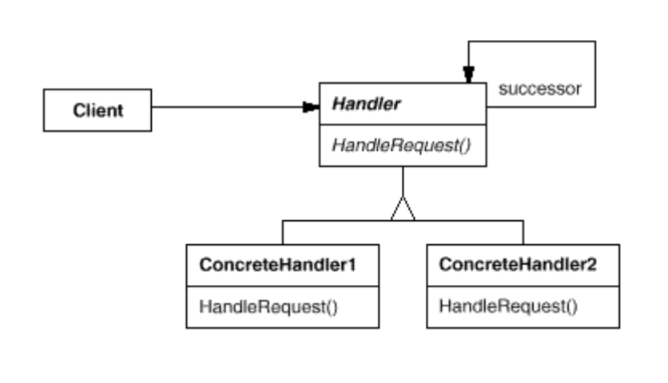

# Chain of Responsibility

## 의도
- 메시지를 보내는 객체와 이를 받아 처리하는 객체들 간의 결합도를 없애기 위한 패턴
- 하나의 요청에 대한 처리가 반드시 한 객체에서만 되지 않고, 여러 객체에게 그 처리 기회를 줌

## 동기
- GUI 에서 도움말 기능을 구현한다면
- 도움말을 요청한 위젯에 따라 다른 내용의 도움말이 나와야 함
- 예를 들어, 다이얼로그에 있는 버튼과 메인 윈도우에 있는 버튼은 같은 버튼이지만, 다른 도움말이 나와야 함
- 해당 위젯에 도움말이 없는 경우 좀 더 제너럴한 내용의 도움말이 나와야 함
- 예를 들어, 다이얼로그 버튼에 도움말이 없는 경우, 다이얼로그에 관한 도움말
- 도움말을 요청한 객체는 도움말을 제공해야 할 객체를 알고 있기가 쉽지 않음
- 도움말을 요청하는 객체와 도움말을 제공하는 객체의 분리가 필요
- 메시지 송신 측과 수신 측을 분리
- 요청은 실제 이 요청을 처리할 객체를 찾을 때까지 객체 연결 고리를 따라 전달
- 연결 고리의 첫 번째 객체가 요청을 받으면 자신이 처리하거나 다음 후보에 전달
- 도움말을 얻을 수 있는 사실을 하드코딩하는 것은 바람직하지 않음
- 연결 고리의 모든 객체들은 공통의 인터페이스를 가져야 함

## 활용성
- 하나 이상의 객체가 요청을 처리해야 하고, 처리자가 미리 알려져있지 않고 자동적으로 확정되어야 할 때
- 메시지를 받을 객체를 명시하지 않은 채 여러 객체 중 하나에게 처리를 요청하고 싶을 때
- 요청을 처리할 수 있는 객체 집합이 동적으로 정의되어야 할 때

## 구조

## 참여자
- Handler
  - 요청을 처리하는 인터페이스를 정의하고, 후속 처리자와 연결을 구현
- ConcreteHandler
  - 책임져야 할 행동이 있다면 스스로 요청을 처리하여 후속 처리자에 접근할 수 있음
- Client
  - ConcreteHandler 객체에게 필요한 요청을 보냄

## 협력 방법
- 사용자는 처리를 요청하고, 이 처리 요청은 실제로 그 요청을 받을 책임이 있는 ConcreteHandler 객체를 만날 때까지 정의된 연결 고리를 따라서 계속 전달

## 결과
- 객체 간의 행동적 결합도가 적어짐
- 객체에게 책임을 할당하는 데 유연성을 높일 수 있음
- 메시지 수신이 보장되지 않음

## 구현
- 후속 처리자들의 연결 고리 구현
  - 새로운 연결을 만드는 것
  - 이미 있는 연결 정보를 사용하는 것
- 후속 처리자 연결
- 처리 요청의 표현부를 정의
  - 요청 자체를 함수로 하드코딩
  - 처리를 코드화하여 매개변수로 받는 처리자 함수를 하나만 정의
- 스몰토크를 쓸 때 자동 전달 기능을 이용

## 예제 코드

## 잘 알려진 사용예
- 사용자의 이벤트를 처리하기 위해
  - MacApp, ET++ 의 EventHandler
  - TCL 의 Bureaucrat
  - NeXT AppKit 의 Responder
- ET++ 에서 그림 갱신을 위해

## 관련 패턴
- Composite pattern
